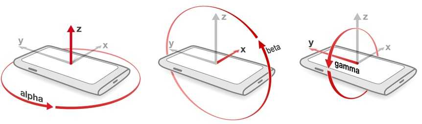

Los ángulos α (alpha), β (beta) y γ (gamma) son los tres ángulos de Euler que proporciona el evento DeviceOrientationEvent en JavaScript. Describen cómo está rotado un dispositivo móvil en el espacio alrededor de sus tres ejes. Son estándar en la Web API y se usan para juegos, AR, brújulas, interfaces reactivas, etc.

A continuación tienes la explicación clara y estructurada:

🧭 Resumen esencial
α (alpha) → rotación alrededor del eje Z → giro como una brújula (yaw).

β (beta) → rotación alrededor del eje X → inclinación adelante/atrás (pitch).

γ (gamma) → rotación alrededor del eje Y → inclinación izquierda/derecha (roll).

Estos valores provienen del giroscopio, acelerómetro y magnetómetro del dispositivo.

📐 ¿Qué representa cada ángulo?
α — Alpha (0° a 360°)
Rotación alrededor del eje Z.

Es el giro horizontal del dispositivo, como cuando lo rotas sobre la mesa.

Se interpreta como yaw.

Útil para brújulas o interfaces que dependen del norte magnético.

β — Beta (–180° a 180°)
Rotación alrededor del eje X.

Es la inclinación adelante/atrás del móvil.

Se interpreta como pitch.

Ejemplo: inclinar el móvil hacia ti o hacia adelante.

γ — Gamma (–90° a 90°)
Rotación alrededor del eje Y.

Es la inclinación izquierda/derecha.

Se interpreta como roll.

Ejemplo: inclinar el móvil como si fuera un volante.

window.addEventListener("deviceorientation", (event) => {
  const { alpha, beta, gamma } = event;
  console.log(alpha, beta, gamma);
});

Estos valores permiten rotar elementos 3D, controlar juegos, mover cámaras en AR, etc.

Recursos: 
📚 1. Documentación oficial (W3C)
W3C Device Orientation and Motion Specification
Define formalmente los ángulos alpha (Z), beta (X) y gamma (Y) y cómo deben exponerse en la Web API.

URL:  
https://www.w3.org/TR/orientation-event/

📚 2. Mozilla Developer Network (MDN) – Referencia técnica
MDN explica el evento deviceorientation, sus propiedades y cómo leer alpha, beta y gamma en JavaScript.

URL:  
https://developer.mozilla.org/en-US/docs/Web/API/DeviceOrientationEvent (developer.mozilla.org in Bing)

📚 3. Apple Developer Documentation (WebKit)
Describe cómo Safari interpreta los ángulos, sus limitaciones y la relación con el giroscopio.

URL:  
https://developer.apple.com/documentation/webkitjs/deviceorientationevent (developer.apple.com in Bing)

📚 4. Artículo técnico en español (Desarrollolibre)
Explica de forma clara y práctica los ejes y los rangos de alpha, beta y gamma.

URL:  
https://desarrollolibre.net/blog/javascript/detectando-la-orientacion-del-dispositivo (desarrollolibre.net in Bing)

📚 5. Recurso educativo (GeeksForGeeks)
Resumen conceptual de los eventos de orientación y su uso en aplicaciones web.

URL:  
https://www.geeksforgeeks.org/web-api-device-orientation-events/ (geeksforgeeks.org in Bing)